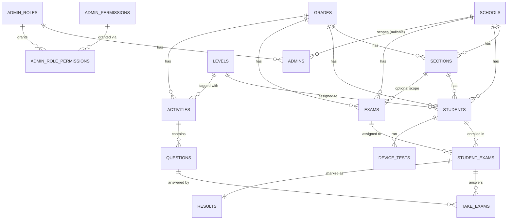

# AST — Database & Migration Reference

Arabic Skill Test (`benchmark-arabicskilltest.com`). This document describes the
schema **as it exists after all 52 migrations have run**, the history of how it
got there, and the gaps that are worth knowing about before a client asks.

Derived from source (`database/migrations/`, `app/Models/`, `app/Support/`) on
2026-08-25. It is not a dump of the live database — see
[Verifying against production](#8-verifying-against-production) at the end.

---

## 1. Version & platform

| Item | Value | Where |
|---|---|---|
| Framework | Laravel **10.x** | `composer.json` |
| PHP | **^8.1** (8.3 recommended) | `composer.json` |
| Frontend | Livewire **3.2**, Blade, Vite 4 | `composer.json`, `package.json` |
| Database | **MySQL 8 / MariaDB** — `u478155822_emsdb` | `.env` |
| Queue | `sync` (no worker running) | `.env` |
| Cache / session | `file` / `database` | `.env` |
| Migrations | **52 files**, 2014-10-12 → 2026-08-03 | `database/migrations/` |
| Seeder | 1 file, `DatabaseSeeder` | `database/seeders/` |
| Auth guards | `web` → `Student`, `admin` → `Admin` | `config/auth.php` |
| Tests | PHPUnit, 10 feature tests | `tests/` |

**Notable packages:** `maatwebsite/excel` (student import, result export),
`simplesoftwareio/simple-qrcode` (QR student login), `stevebauman/location`
(IP geolocation for `ip_logs`), `opcodesio/log-viewer` (`/sf-log-viewer`),
`intervention/image` (uploads).

There is **no multi-tenancy layer**. One database, one deployment, all schools in
the same tables, separated only by `school_id` filters written by hand in each
Livewire component.

---

## 2. Entity map



**Grades and Levels are global, not per-school.** `grades` and `levels` have no
`school_id`. Every school shares the same "Year 1..10" and "Level 1..10" lists.
Only `sections`, `students` and `exams` are school-scoped.

---

## 3. Table reference

### 3.1 Structure

#### `schools`

| Column | Type | Notes |
|---|---|---|
| id | bigint PK | |
| name | string | title-cased by the model |
| address, phone_number, email, principal | string null | |
| school_type | enum(`Public`,`Private`) null | |
| establishment_year | year null | |
| website, logo | string null | |
| accreditation | string null | **column exists, never read or written** |
| additional_notes | text null | |
| created_at / updated_at | timestamp | DB-level defaults |

#### `grades` — the "Year" list

| Column | Type | Notes |
|---|---|---|
| id | bigint PK | |
| admin_id | FK admins null | who created it |
| name | string | e.g. `Year 3` |
| number | uint UNIQUE null | canonical ordering, added 2026-08-01 |
| old_grades | json null | legacy grade ids this row absorbed |
| ~~level~~ | — | **DROPPED** 2026-08-03 |

#### `levels` — proficiency ladder (added 2026-08-01)

| Column | Type | Notes |
|---|---|---|
| id | bigint PK | |
| name | string | `Level 1` … |
| number | uint UNIQUE | |
| legacy_labels | json null | old string labels (`A`, `B+`, …) that map here |
| admin_id | FK admins **NOT NULL** | cascade on delete |

#### `sections`

`id`, `grade_id` (FK, null on delete), `school_id` (FK, cascade), `name`, timestamps.

#### `students`

| Column | Type | Notes |
|---|---|---|
| id | bigint PK | |
| school_id | FK schools cascade | |
| section_id | FK sections null | |
| grade_id | FK grades null | |
| level_id | FK levels null | added 2026-08-01, backfilled from `level` |
| name | string null | title-cased |
| registration | string | **UNIQUE(registration, year)** since 2026-07-23 |
| year | usmallint NOT NULL | academic year, defaulted to 2026 on migration |
| user_name | string UNIQUE | login handle |
| nationality, category, image | string null | |
| password | string null | |
| deleted_at | soft delete | archiving |
| last_login_at, email_verified_at | timestamp null | |
| ~~level~~ | — | **DROPPED** 2026-08-03 |

Students authenticate on the `web` guard. Soft-deleted ("archived") students
still occupy the `(registration, year)` unique pair — see
`Student::hasActiveRegistrationConflict()`.

### 3.2 Content / question bank

#### `activities` — one passage, audio clip or prompt

| Column | Type | Notes |
|---|---|---|
| id | bigint PK | |
| level_id | FK levels null | added 2026-08-01 |
| grade_id | FK grades null | added 2026-08-01 |
| term | string null | added 2026-04-16 |
| title | string null | |
| activity | text null | body / media reference |
| image | string null | |
| type | enum(`reading`,`listening`,`writing`,`speaking`,`sentences_structures`) | |
| lang | enum(`english`,`arabic`) default `english` | added 2026-08-03 |
| ~~level~~ | — | **DROPPED** 2026-08-03 |

No `school_id` — **the question bank is shared by every school.**

#### `questions`

`id`, `activity_id` (FK null), `question` text, `options` text
(**PHP-serialized array**), `correct_answer` text, `image`, `type` enum:
`MCQs`, `true-false`, `blanks`, `typing`, `rearrange`, `match`, `writing`,
`speaking`, `match_words`.

#### `instructions`

`id`, `page`, `instructions` (HTML). Six seeded pages: `dashboard_instructions`,
and `{reading|listening|writing|speaking|sentences_structures}_exam_instructions`.
Edited from admin → Instruction pages. **Still contains lorem ipsum placeholder
text as seeded.**

#### `options` — key/value settings

| key | value |
|---|---|
| `web_name`, `web_email`, `logo` | branding |
| `terms` | serialized array, seeded `['midterm','summer','sessional']` |
| `current_academic_year` | `2026` |
| ~~`levels`~~ | **deleted** by the 2026-08-03 cleanup (replaced by `levels` table) |

#### `uploads`

`id`, `path`. Images are stored as a row and referenced by id from
`app/Helpers/CustomHelpers.php`.

### 3.3 Exam runtime

#### `exams` — an exam *configuration*, not a paper

| Column | Type | Notes |
|---|---|---|
| id | bigint PK | |
| school_id | FK schools null | |
| grade_id | FK grades cascade | |
| section_id | FK sections **nullable since 2026-07-16** | `NULL` = grade-wide |
| level_ids | json null | which levels this exam covers, added 2026-08-02 |
| reading_activities | text | **serialized array of activity ids** |
| listening_activities | text | serialized |
| speaking_activities | text | serialized |
| writing_activities | text | serialized |
| sentences_structures_activities | text | serialized, added 2025-12-18 |
| reading_time … sentences_structures_time | string | minutes per skill |
| term | string | matches an `options.terms` entry |
| status | enum(`pending`,`active`,`suspended`,`expired`) | |
| deleted_at | soft delete | added 2026-08-03 ("archive") |
| ~~level~~ | — | **DROPPED** 2026-08-03 |

`Exam::$fillable` lists `time_allocated`, but **no such column exists** in any
migration. Harmless today, but misleading.

#### `student_exams` — one student's enrolment in one exam

`id`, `student_id` (FK cascade), `exam_id` (FK cascade), `checked` bool default 0,
and five `*_status` text columns (`reading_status`, `listening_status`,
`writing_status`, `speaking_status`, `sentences_structures_status`) holding
**serialized arrays** — attempt state, timestamps, and `device_ip`.

**UNIQUE(student_id, exam_id)** since 2026-08-03 (the migration deletes existing
duplicates first).

#### `take_exams` — one answer to one question

`id`, `student_exam_id` (FK null), `student_id` (FK cascade), `question_id`
(FK null), `answer` text, `type` enum (same nine values as `questions.type`).
Written with `updateOrCreate`, so re-answering overwrites.

#### `results` — marks awarded by an admin

`id`, `student_exam_id` (FK null), `reading_marks`, `listening_marks`,
`writing_marks`, `speaking_marks`, `sentences_structures_marks`, `remarks`.

> ⚠️ Every `*_marks` column is **`VARCHAR(255)`** but stores a **PHP-serialized
> array** of per-question marks. See risk #2 below.

### 3.4 Access control

`admins` — `role_id` (FK admin_roles), `school_id` (FK schools, **nullable**,
added 2026-01-28 — this is what scopes an admin to one school), name, email
(unique), password, image, soft deletes, `last_login_at`.

`admin_roles` — `name`, `slug` (`super-admin` is the seeded one).
`admin_permissions` — `key`, `name`, and default `view`/`add`/`edit`/`delete` flags.
`admin_role_permissions` — the join, with its own `view`/`add`/`edit`/`delete`.

Permission keys in use: `admin_roles`, `schools`, `classes`, `students`,
`question_banks`, `exams`, `results`, `profile`, `admins`, `options`, `levels`.
Checked by `permissions:<key>,<action>` middleware on each admin route.

### 3.5 Operational

`device_tests` — `student_id`, `device_info` json, `test_results` json,
`overall_status` enum(`started`,`failed`,`passed`). The mic/audio pre-flight check.

`ip_logs` — `ip`, `location`, `path`, `username`, polymorphic `loggable`
(Student or Admin). Surfaced at admin → Auth logs.

### 3.6 Dead tables

These exist in the schema but nothing reads or writes them:

| Table | Why it's dead |
|---|---|
| `users` | The `web` guard's provider points at `App\Models\Student`, not `User`. Laravel default, never removed. |
| `question_banks` | `id` + `type` enum only, no timestamps. `QuestionBank` model is empty and referenced nowhere. Superseded by `activities`. |
| `personal_access_tokens` | Sanctum installed, no API tokens issued. |
| `failed_jobs` | Queue driver is `sync`. |

---

## 4. Migration history

52 migrations in five phases. The dates tell the story.

### Phase 1 — Laravel defaults (2014 – 2019, 4 files)

`users`, `password_reset_tokens`, `failed_jobs`, `personal_access_tokens`.

### Phase 2 — Admin & access (2023-11, 5 files)

`admin_permissions`, `admin_roles`, `admin_role_permissions`, `admins`, `options`.

### Phase 3 — Core domain (2024-01 → 2024-02, 13 files)

`schools`, `uploads`, `grades`, `sections`, `students`, `activities`,
`questions`, `question_banks`, `exams`, `student_exams`, `take_exams`,
`results`, `instructions`. This is the original system as first shipped.

### Phase 4 — Incremental features (2024-10 → 2026-07, 12 files)

| Date | Change |
|---|---|
| 2024-10-07 | `match_words` added to `questions.type` and `take_exams.type` |
| 2025-05-12 | `ip_logs` created |
| 2025-12-17 | `level` widened 10 → 100 chars on `grades` and `exams` |
| 2025-12-18 | **Sentence Structures skill added** — new enum value, new columns on `exams`, `student_exams`, `results`, plus an instructions page |
| 2026-01-28 | `admins.school_id` — admins can be scoped to one school |
| 2026-04-16 | `activities.term` added. **This migration also runs `UPDATE exams SET status='expired'` on every row.** |
| 2026-05-23 | `device_tests` created |
| 2026-07-16 | `exams.section_id` made nullable → grade-wide exams become possible |
| 2026-07-23 | `students.year` added, backfilled to 2026; unique key moves from `registration` to `(registration, year)`; `user_name` made unique |

### Phase 5 — The levels/grades normalisation (2026-08-01 → 2026-08-03, 18 files)

The biggest change in the project's history: free-text `level` strings
(`"A"`, `"B+"`) and ad-hoc grade names became proper `levels` and `grades`
tables with foreign keys.

| Order | Migration | What it does |
|---|---|---|
| 1 | `create_levels_table` | Creates `levels`, seeds Levels 1–10, **and inserts the `levels` admin permission** |
| 2 | `add_level_id_and_number_to_grades_table` | Adds `grades.number`, seeds Year 1–10 |
| 3 | `remove_level_id_from_grades_table` | Undoes a `level_id` column from an earlier attempt |
| 4 | `sync_legacy_levels_from_options` | Adds `levels.legacy_labels`, maps old `options.levels` strings onto the new rows |
| 5 | `add_level_id_to_students_and_backfill` | `students.level_id` + FK + backfill |
| 6 | `sync_legacy_grades_old_grades` | Adds `grades.old_grades`, records which legacy rows merged in |
| 7 | `backfill_students_grade_id` | Repoints `students.grade_id` at canonical grades |
| 8 | `add_level_id_and_grade_id_to_activities_and_backfill` | Same for the question bank |
| 9 | `add_level_ids_to_exams_and_backfill` | `exams.level_ids` json + backfill |
| 10 | `backfill_sections_and_remaining_table_grade_ids` | Sweeps up `sections` and stragglers |
| 11 | `add_lang_to_activities_table` | `activities.lang` (english/arabic) |
| 12 | `cleanup_legacy_level_columns_and_grades` | **Drops `level` from `grades`, `students`, `exams`, `activities`; deletes legacy grade rows (`number IS NULL`); deletes `options.levels`** |
| 13 | `prune_old_grades_references_after_legacy_cleanup` | Cleans dangling ids out of `old_grades` json |
| 14 | `add_soft_deletes_to_exams_table` | Exam archiving |
| 15 | `add_unique_student_exam_pair_index` | De-duplicates then locks `(student_id, exam_id)` |

The heavy lifting lives in `app/Support/` — `BackfillLevelIds`,
`BackfillStudentGradeIds`, `BackfillActivityLevelGradeIds`,
`BackfillExamLevelGradeIds`, `BackfillTableGradeIds`, `SyncLegacyLevelsFromOptions`,
`SyncLegacyGradesToOldGrades`, `CleanupLegacyLevelColumns`, plus
`LevelLabelParser` / `GradeLabelParser` / `*LegacyResolver` for the string
matching. `CleanupLegacyLevelColumns` writes a JSON report to
`storage/logs/cleanup-legacy-level-columns-*.json` — **that file is the audit
trail for what production actually deleted.**

---

## 5. Serialized columns

The project stores PHP `serialize()` output in text/varchar columns rather than
JSON. Anything in this list is **unreadable from plain SQL and unqueryable with
JSON functions**:

| Table | Columns |
|---|---|
| `exams` | `reading_activities`, `listening_activities`, `speaking_activities`, `writing_activities`, `sentences_structures_activities` |
| `student_exams` | `reading_status`, `listening_status`, `writing_status`, `speaking_status`, `sentences_structures_status` |
| `results` | `reading_marks`, `listening_marks`, `writing_marks`, `speaking_marks`, `sentences_structures_marks` |
| `questions` | `options` |
| `options` | `terms` |

Filtering by status is done with `LIKE` against the serialized string — see
`StudentExam::serializedStatusLikePattern()`. Columns added *after* 2026-08
(`exams.level_ids`, `grades.old_grades`, `levels.legacy_labels`,
`device_tests.*`) correctly use real JSON.

---

## 6. Known gaps and risks

Ordered by how likely they are to bite.

### 🔴 1. A clean install cannot be created

`migrate:fresh --seed` (the `/install` route) does not work:

- `create_levels_table` seeds Levels 1–10 **only `if admins.id = 1 exists`**. On
  a fresh migrate the `admins` table is empty (the seeder runs *after*
  migrations), so **no levels are created**.
- `add_level_id_and_number_to_grades_table` seeds Year 1–10 under the same
  condition — **no grades are created** either.
- `DatabaseSeeder` then calls `Grade::insert([... 'level' => 'A' ...])`, but
  `cleanup_legacy_level_columns_and_grades` has already **dropped
  `grades.level`** → SQL error, seeding aborts.

**Consequence:** there is no reproducible path from an empty database to a
working system. Production works only because it was migrated forward from an
existing 2024 database. Staging/dev environments have to be built from a
production dump.

### 🔴 2. `results.*_marks` will silently truncate

The columns are `VARCHAR(255)` but hold serialized arrays of per-question marks.
A serialized array of roughly 15–20 marks exceeds 255 bytes. MySQL in
non-strict mode truncates silently; in strict mode it throws. **Either way marks
are lost or unsavable** past a certain exam length. These should be `TEXT`.

### 🟠 3. `School::Grade()` is a broken relationship

`app/Models/School.php:42` declares `hasMany(Grade::class, 'school_id')`, but
`grades` has **no `school_id` column**. Calling it throws. Nothing calls it today.
The underlying fact matters: **grades and levels are global**, so one school
cannot have its own year structure or its own naming.

### 🟠 4. The question bank is shared across all schools

`activities` has no `school_id`. Every school's admins see and can use every
other school's reading passages, audio and prompts. If clients expect isolation,
this is a schema change, not a filter change.

### 🟠 5. A migration expired every exam in production

`2026_04_16_000001_add_term_to_activities_table` runs
`DB::table('exams')->update(['status' => 'expired'])`. If a client reports
"all our exams went expired in April", this is why.

### 🟡 6. No database-level guard against duplicate exams

Duplicate prevention for school+grade+term is app-level only
(`Exam::existsForGradeTerm()`). There is no unique index, so two admins saving
at once can create two grade-wide exams for the same term. Resolution then
picks the newer one, so it degrades rather than breaks — but the data is dirty.

### 🟡 7. Several migrations are not reversible

`backfill_students_grade_id`, `backfill_sections_and_remaining_table_grade_ids`,
`cleanup_legacy_level_columns_and_grades` and
`prune_old_grades_references_after_legacy_cleanup` have **empty `down()`**
methods. Rolling back past 2026-08-01 is a one-way door — the legacy `level`
strings are gone. Restore from backup instead.

### 🟡 8. Two migrations share the timestamp `2026_08_03_000001`

`add_lang_to_activities_table` and `cleanup_legacy_level_columns_and_grades`.
They currently order correctly by filename (`add_` sorts before `cleanup_`), but
that is accidental, not designed.

### 🟡 9. The `levels` permission is created by a migration, not the seeder

`DatabaseSeeder` seeds 10 permission keys; `levels` is inserted by
`create_levels_table`. Reseeding without migrating leaves the Levels screen
inaccessible.

### 🟡 10. Unauthenticated maintenance routes

`routes/web.php` exposes `GET /migrate` (runs migrations) and
`GET /clear-cache` — both with **no auth**. `GET /install` is guarded only by
`APP_ENV !== 'production'`.

### ⚪ 11. Cosmetic drift

- `Exam::$fillable` lists `time_allocated` — no such column.
- `schools.accreditation` — column never used.
- `users`, `question_banks`, `failed_jobs`, `personal_access_tokens` — dead tables.
- Seeded instruction pages still contain lorem ipsum.

---

## 7. Likely client questions

**"What version is this on?"**
Laravel 10, PHP 8.1+, Livewire 3, MySQL. Laravel 10's security-fix window closed
in **February 2026**, so the framework is now unsupported upstream. An upgrade to
Laravel 11/12 is the main platform item on the horizon.

**"Can each school have its own year/level structure?"**
No. `grades` and `levels` are global tables with no `school_id`. Sections,
students and exams are school-scoped; the ladder above them is shared.

**"Can each school have its own question bank?"**
No — `activities` and `questions` are global too. Filtering is by level, grade,
term and skill, not by school.

**"How many skills are tested?"**
Five: reading, listening, writing, speaking, sentence structures. The fifth was
added in December 2025.

**"Can a student sit the same exam twice?"**
No. `student_exams` is UNIQUE on `(student_id, exam_id)`, and each skill's
status blob records the attempt. Re-attempting is blocked in
`SkillExams::attempt()`.

**"What happens when we roll over to a new academic year?"**
`students` are unique on `(registration, year)`, so the same registration number
can be re-enrolled in a new year. The active year is `options.current_academic_year`
(currently 2026), editable from admin → Settings.

**"Can we delete a school / student / exam?"**
Students, admins and exams are **soft-deleted** (archived, recoverable). Schools,
grades, sections, activities and questions are **hard-deleted** with cascading
foreign keys — deleting a school cascades to its sections and students.

**"Is student data isolated between schools?"**
Only by application-level `school_id` filters written per Livewire component
(`RestrictsToAdminSchool` trait, `admins.school_id`). There is no global scope or
database-level enforcement, so isolation depends on every query being written
correctly.

**"Where do the exam questions come from?"**
An admin builds `activities` (a passage/clip/prompt) with `questions` attached,
then an exam picks activity ids per skill. The exam row stores those ids as a
serialized array — it does not copy the questions, so **editing an activity
changes exams that already reference it**, including exams already sat.

---

## 8. Verifying against production

This document is derived from source. To confirm the live schema matches:

```bash
# what the live DB thinks has run
php artisan migrate:status

# real column list for a table
php artisan db:show --counts
php artisan db:table exams
```

```sql
-- confirm the legacy cleanup actually completed
-- (both should return zero rows)
SHOW COLUMNS FROM grades LIKE 'level';
SHOW COLUMNS FROM students LIKE 'level';
```

```bash
# audit trail of what the cleanup deleted
ls storage/logs/cleanup-legacy-level-columns-*.json
```

Any drift between `migrate:status` and this list means production was patched by
hand — check before promising a client anything about the schema.

---

## Related documents

- `EXAM_UPDATES.md` — how a student's applicable exam is resolved (grade-wide vs
  legacy section exams). Read this before touching `Exam::pickResolvedFromCandidates()`.
- `docs/EXAM_SECTION_SAFE_MIGRATION_GUIDE.md` — the safe procedure for the
  section → grade-wide exam migration.
